## Concurrent Trie Data Structure ⭐

Implementation of Concurrent Trie Data Structure using Single Locking, Reader Writer's Locking and Hand over Hand Locking. 

### Directory Structure 📁

```
concurrent_trie
├─ concurrent_threads
│  ├─ 50-50.png
│  ├─ 50-50_final.png
│  ├─ CSV
│  │  ├─ hoh_lock.csv
│  │  ├─ rw_lock.csv
│  │  └─ s_lock.csv
│  ├─ data
│  │  ├─ find
│  │  │  └─ work.txt
│  │  ├─ initial
│  │  │  └─ work.txt
│  │  ├─ pref
│  │  │  └─ work.txt
│  │  └─ rem
│  │     └─ work.txt
│  ├─ generate.h
│  ├─ hoh_lock_trie.c
│  ├─ Makefile
│  ├─ plot.py
│  ├─ Read_Intensive.png
│  ├─ Read_Intensive_final.png
│  ├─ rw_lock_trie.c
│  ├─ s_lock_trie.c
│  ├─ workload.py
│  ├─ Write_Intensive.png
│  └─ Write_Intensive_final.png
├─ Makefile
├─ README.md
├─ tests
│  ├─ multi_thread
│  │  ├─ find
│  │  │  ├─ 1.txt
│  │  │  ├─ 2.txt
│  │  │  ├─ 3.txt
│  │  │  ├─ exp_find_1.txt
│  │  │  ├─ exp_find_2.txt
│  │  │  └─ exp_find_3.txt
│  │  ├─ initial
│  │  │  ├─ 1.txt
│  │  │  ├─ 2.txt
│  │  │  ├─ 3.txt
│  │  │  └─ exp_ins.txt
│  │  ├─ pref
│  │  │  ├─ 1.txt
│  │  │  ├─ 2.txt
│  │  │  ├─ 3.txt
│  │  │  ├─ exp_1.txt
│  │  │  ├─ exp_2.txt
│  │  │  └─ exp_3.txt
│  │  └─ rem
│  │     ├─ 1.txt
│  │     ├─ 2.txt
│  │     ├─ 3.txt
│  │     └─ exp.txt
│  └─ single_thread
│     ├─ exp_ins.txt
│     ├─ exp_rem.txt
│     ├─ find_test.txt
│     ├─ find_test_exp.txt
│     ├─ initial.txt
│     ├─ pref_text.txt
│     ├─ pref_text_exp.txt
│     └─ rem_list.txt
├─ trie.c
├─ trie.h
└─ trie_size
   ├─ 50-50.png
   ├─ 50-50_final.png
   ├─ CSV
   │  ├─ hoh_lock.csv
   │  ├─ rw_lock.csv
   │  └─ s_lock.csv
   ├─ data
   │  ├─ find
   │  │  └─ 1.txt
   │  ├─ initial
   │  │  └─ 1.txt
   │  ├─ pref
   │  │  └─ 1.txt
   │  └─ rem
   │     └─ 1.txt
   ├─ generate.h
   ├─ hoh_lock_trie.c
   ├─ Makefile
   ├─ plot.py
   ├─ Read_Intensive.png
   ├─ Read_Intensive_final.png
   ├─ rw_lock_trie.c
   ├─ s_lock_trie.c
   ├─ workload.py
   ├─ Write_Intensive.png
   └─ Write_Intensive_final.png

```

### Feature Checklist ✅
```
✅ Concurreny
✅ Autocompletion, Insert, Find, Delete Key and Delete Trie
✅ Single Locking
✅ Hand Over Hand Locking
✅ Reader-Writer's Locking 
```

### Instructions to Run 🏃

- Run `make` to run all the tests. For specific tests, follow the instructions below:

### Compiling the test code:
- **Single Threaded:** `make test_trie_single_threaded`
- **Multi Threaded (Single Locking):** `make test_trie_s_lock` 
- **Multi Threaded (R/W Lock):** `make test_trie_rw_lock`
- **Multi Threaded (Hand on Hand Lock):** `make test_trie_hoh_lock`


### Compiling and running the tests:
- **Single Threaded:** `make single_threaded`
- **Multi Threaded (Single Locking):** `make s_lock` 
- **Multi Threaded (R/W Lock):** `make rw_lock`
- **Multi Threaded (Hand on Hand Lock):** `make hoh_lock`

### Load Testing 🚦

  - Install numpy using `pip install numpy`
  - Install scipy using `pip install scipy`
  - Install matplotlib using `pip install matplotlib`
  
### Concurrent Threads

In the concurrent_threads folder:

  - Run `make workload` to generate the workload.
  - Run `make` to compile and execute the files as well as create the plots.
  
### Trie Size

In the trie_size folder:

  - Run `make workload` to generate the workload.
  - Run `make` to compile and execute the files as well as create the plots.


### Results and Conclusions 📊

For plotting insert and find have been used for 50-50 workload, while only insert and find are used in write intensive case and read intensive case respectively.
 
### Concurrent Threads

* Varying the number of concurrent threads from 1 to 100
* Workload with 100000 entries per file

* Plot for 50-50 workload

50-50 Workload|  50-50 Workload Averaged
:-------------------------:|:-------------------------:
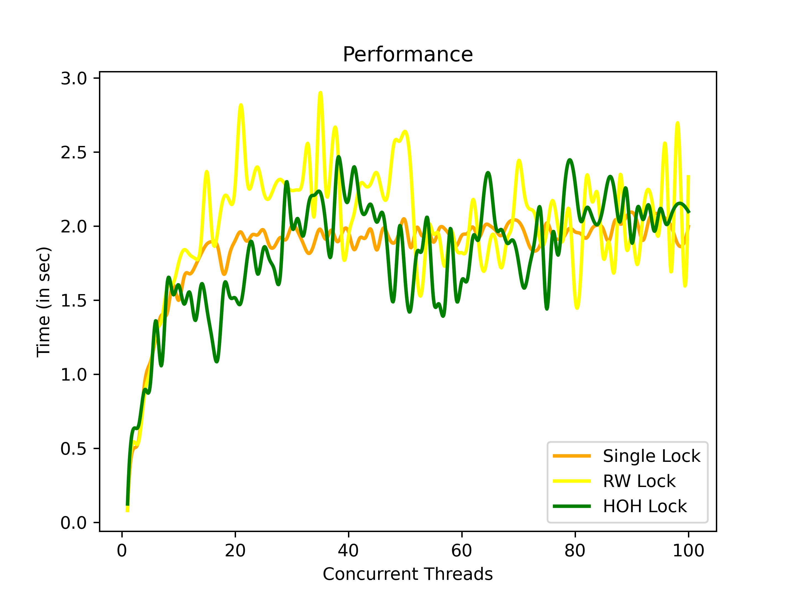  |  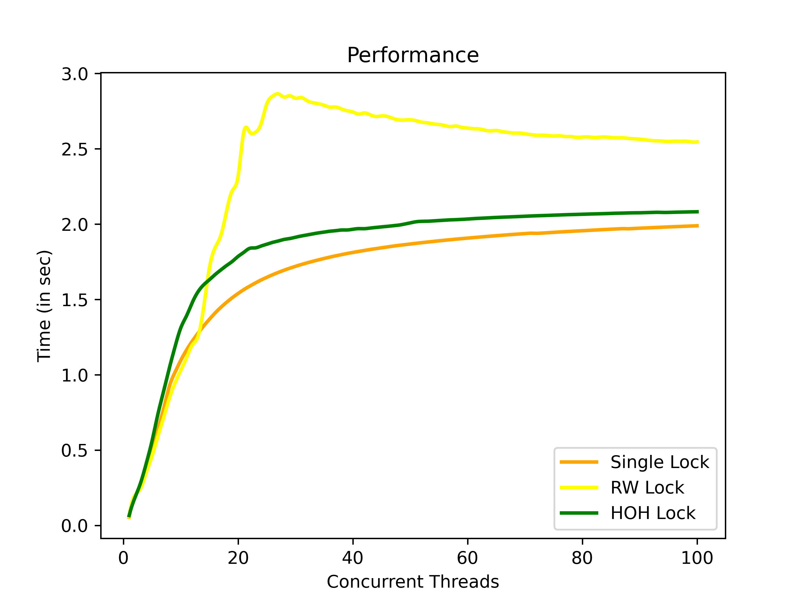

* Plot for Read Intensive workload

Read Intensive Workload|  Read Intensive Workload Averaged
:-------------------------:|:-------------------------:
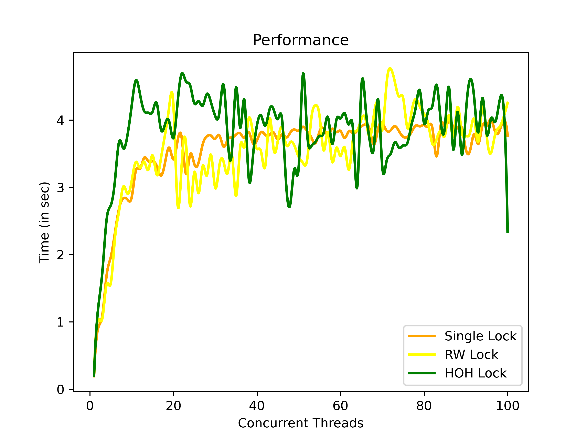  | 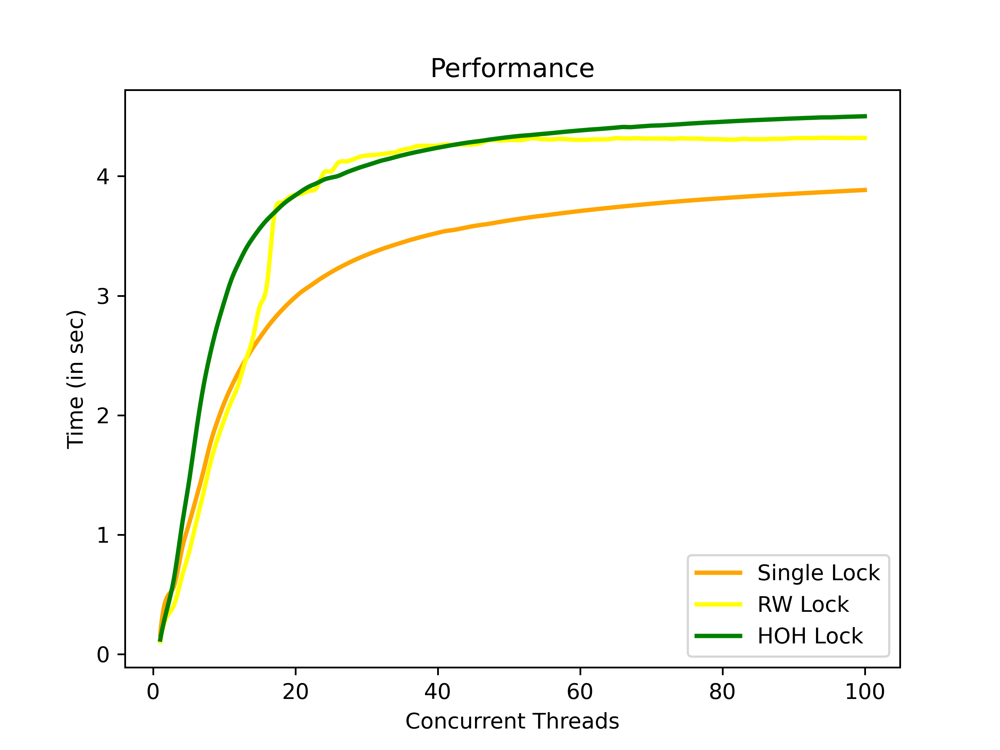

* Plot for Write Intensive workload

Write Intensive Workload|  Write Intensive Workload Averaged
:-------------------------:|:-------------------------:
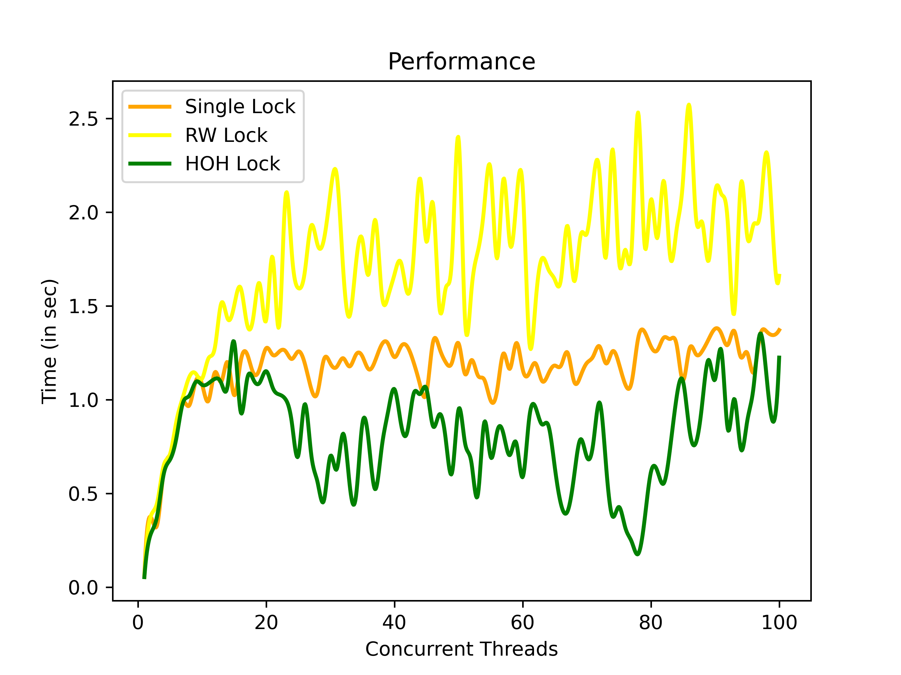  | 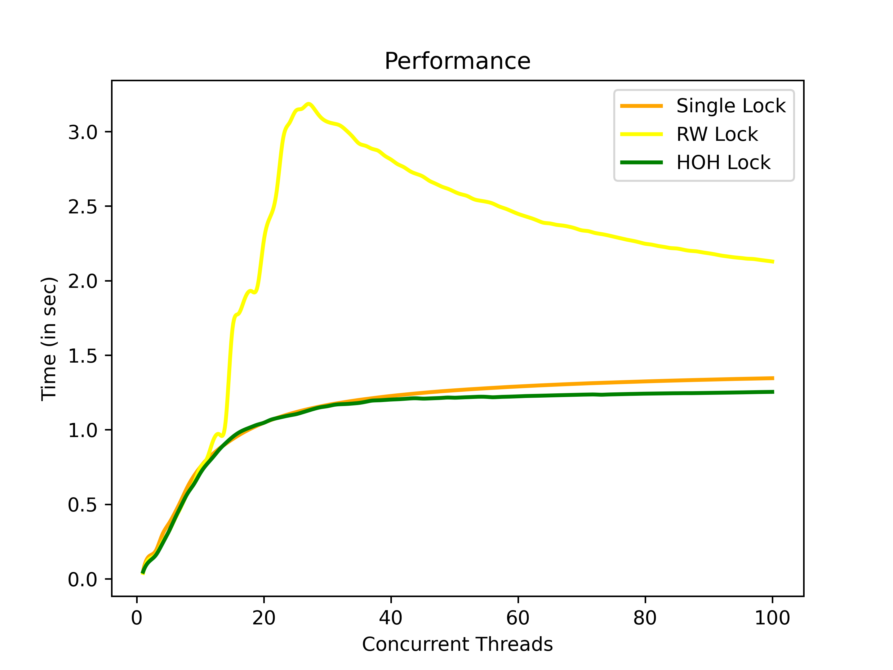


### Trie Size

* Varying the trie size from 1 to 100
* Taking 100 concurrent threads
* Workload with 15000 entries per file

* Plot for 50-50 workload

50-50 Workload|  50-50 Workload Averaged
:-------------------------:|:-------------------------:
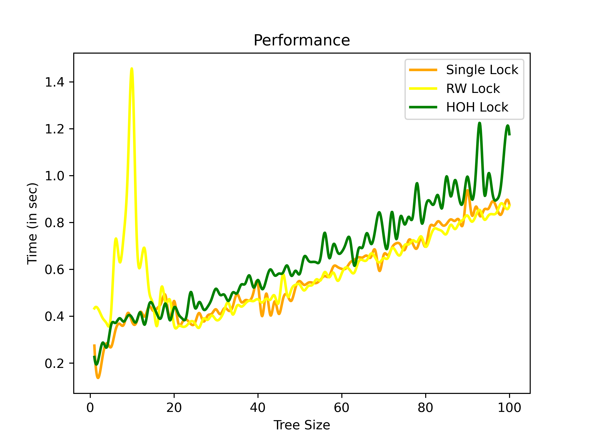  |  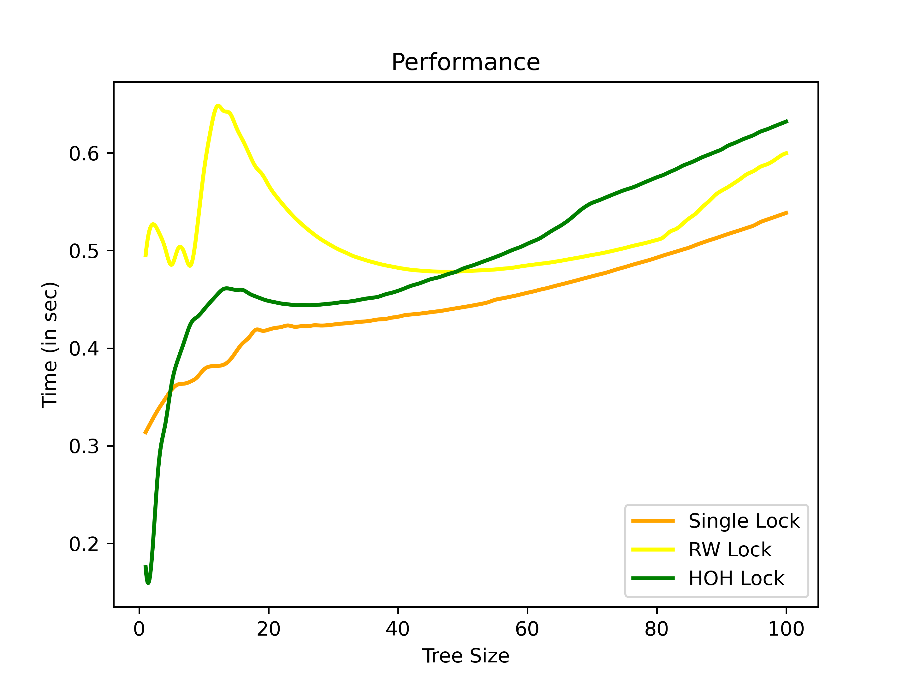

* Plot for Read Intensive workload

Read Intensive Workload|  Read Intensive Workload Averaged
:-------------------------:|:-------------------------:
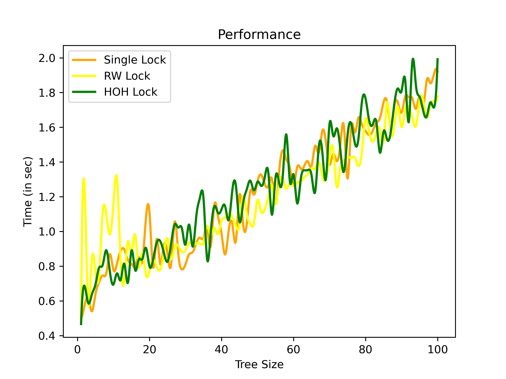  | 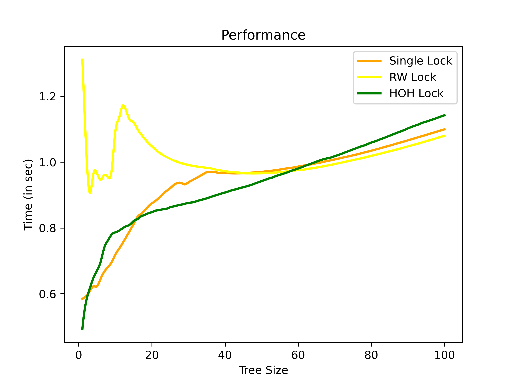

* Plot for Write Intensive workload

Write Intensive Workload|  Write Intensive Workload Averaged
:-------------------------:|:-------------------------:
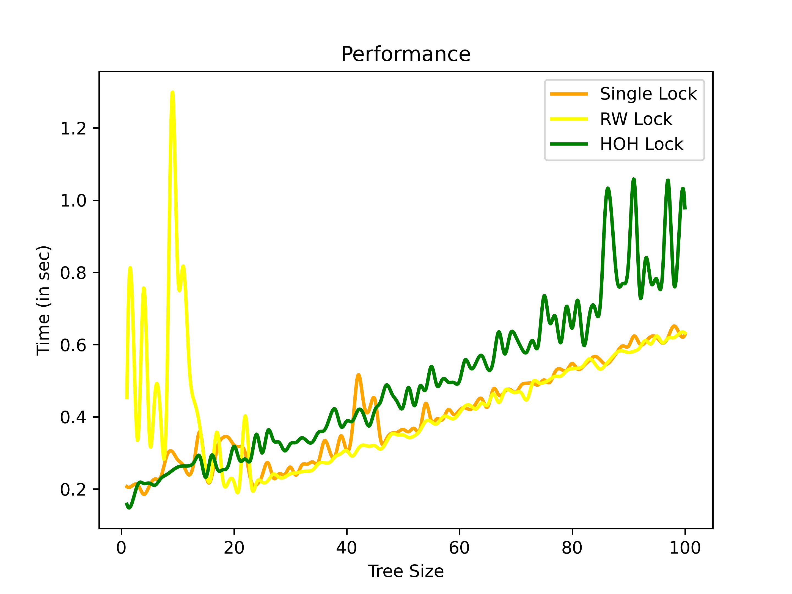   | 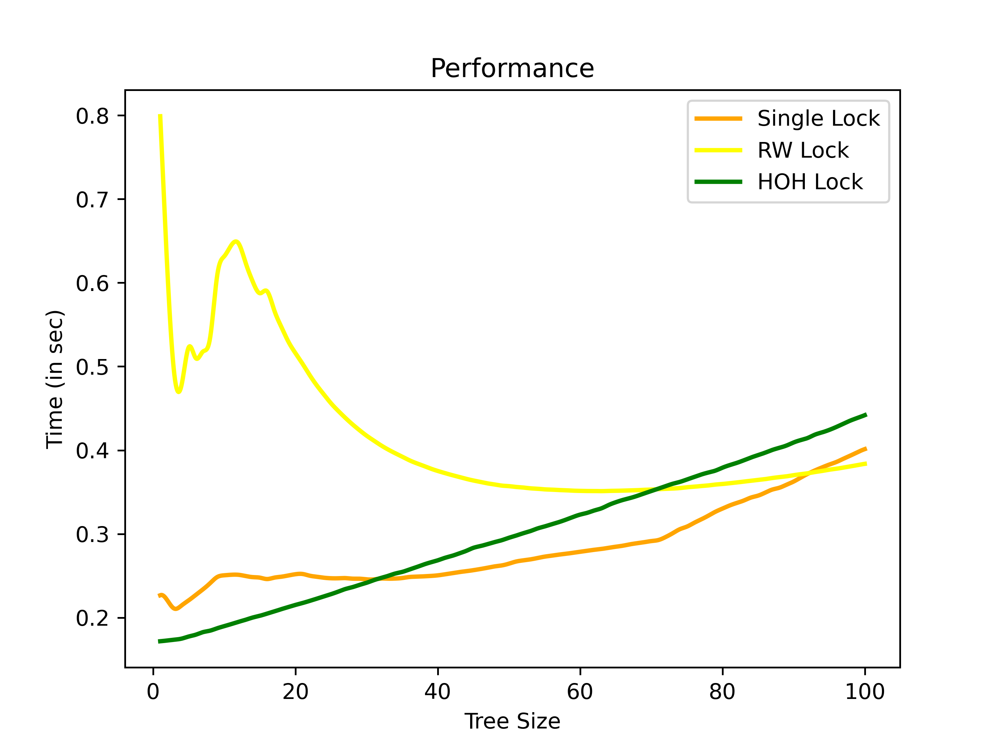

   
