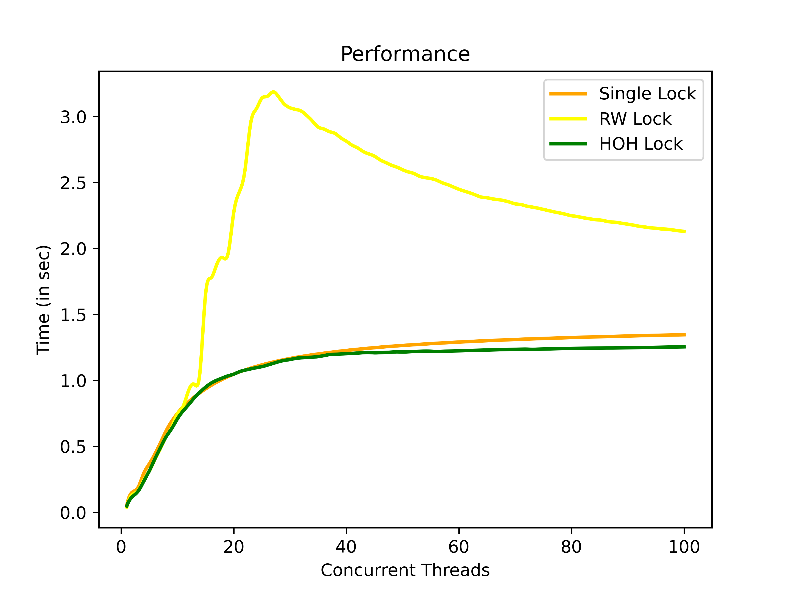
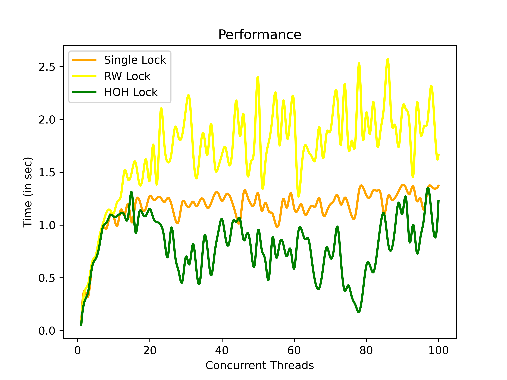
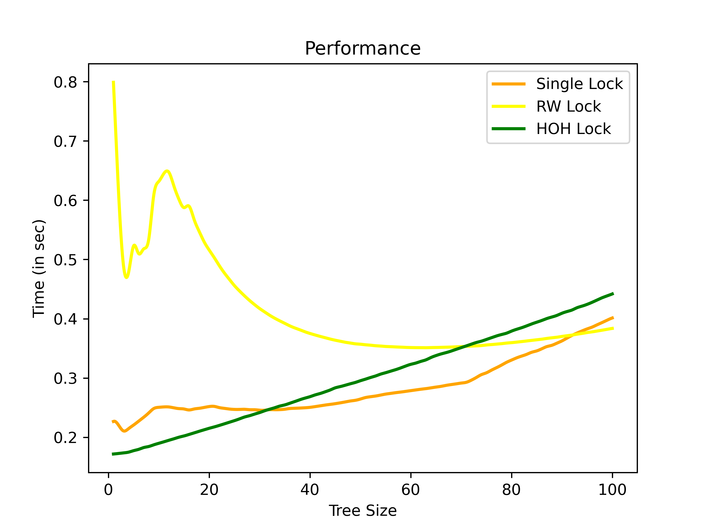
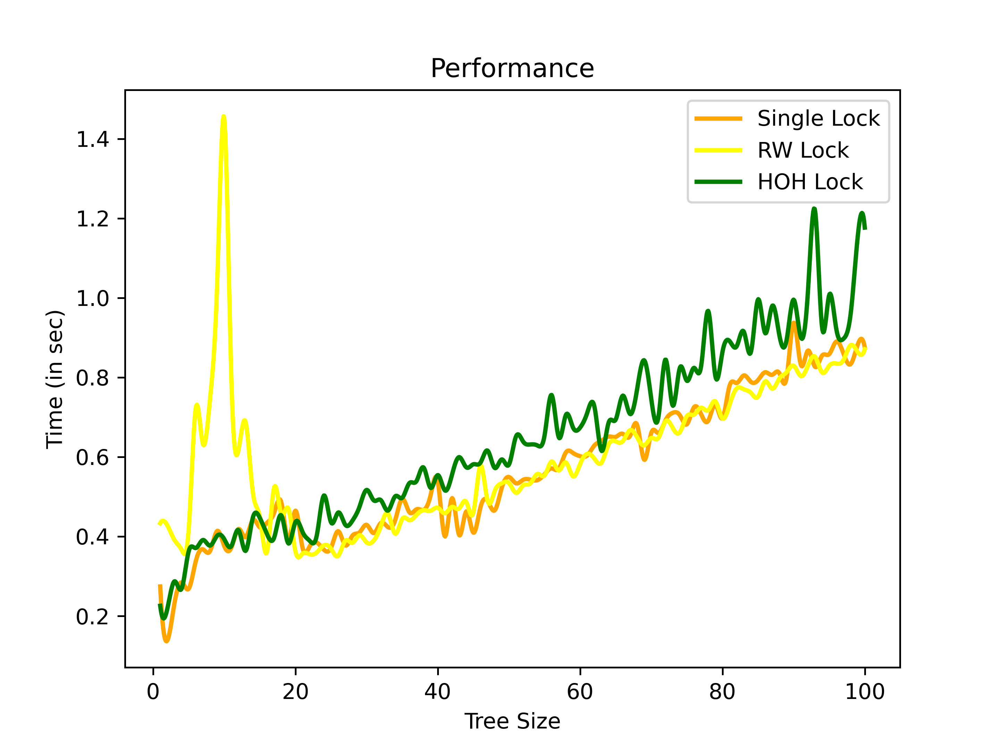
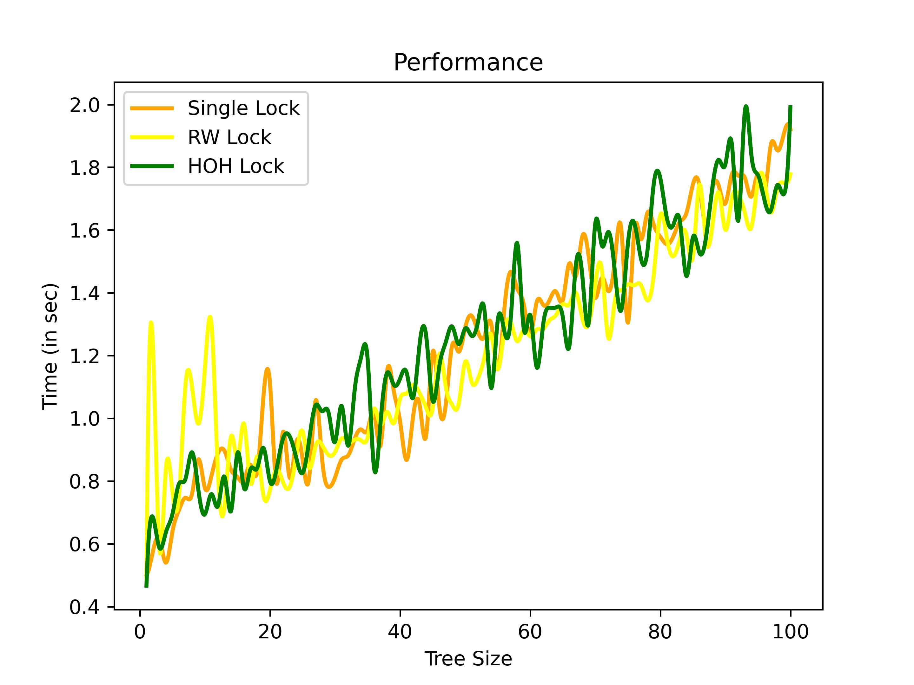

## Plots

## Concurrent Threads

### Averaged Out Plots

* Varying the number of concurrent threads from 1 to 100
* Workload with 100000 entries per file

* Plot for 50-50 workload

* Plot for Read Intensive workload

* Plot for Write Intensive workload

### Non Averaged Out Plots

* Plot for 50-50 workload

* Plot for Read Intensive workload

* Plot for Write Intensive workload

## Trie Size

* Varying the trie size from 1 to 100
* Taking 100 concurrent threads
* Workload with 15000 entries per file

### Averaged Out Plots

* Plot for 50-50 workload

* Plot for Read Intensive workload

* Plot for Write Intensive workload

### Non Averaged Out Plots

* Plot for 50-50 workload

* Plot for Read Intensive workload

* Plot for Write Intensive workload
